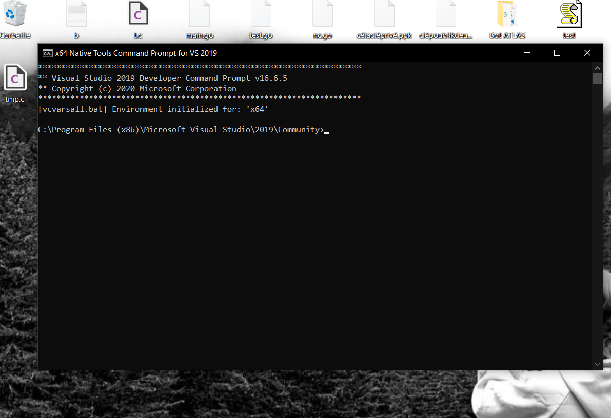
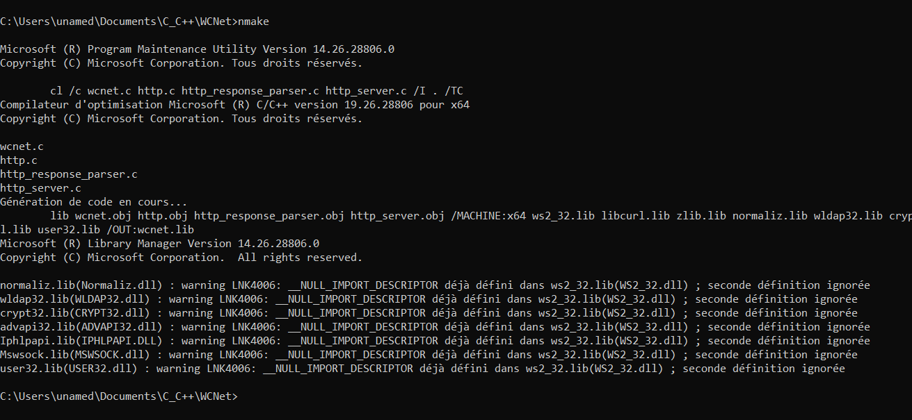
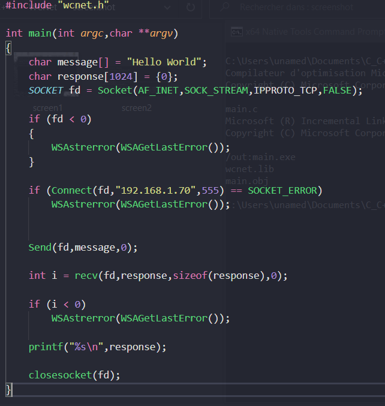
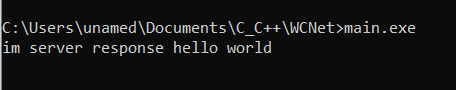

# WCNet
Windows C Net Library Version 1.0 (first version)

WCNet is network library for windows operating system in development the last version is 1.0 is the first version of this library you find the documentation at the bottom

# Required
  - windows operating system
  - msvc installed (if it is not installed install this -> https://visualstudio.microsoft.com/fr/downloads/ download community edition)


# How to install ?
  open "x64 native command prompt for VS 2019" and change the directory with the command "cd" to the directory where is WCNet
  after run this command "nmake"
  this command will build the library named wcnet.lib
  





```c
#include "wcnet.h"

//compile : cl.exe main.c /TC /I . /link wcnet.lib

int main(int argc,char **argv)
{
    char message[] = "Hello World";
    char response[1024] = {0};
    SOCKET fd = Socket(AF_INET,SOCK_STREAM,IPPROTO_TCP,FALSE);

    if (fd < 0)
    {
        WSAstrerror(WSAGetLastError());
    }

    if (Connect(fd,"192.168.1.70",555) == SOCKET_ERROR)
        WSAstrerror(WSAGetLastError());
    

    Send(fd,message,0);

    int i = recv(fd,response,sizeof(response),0);

    if (i < 0)
        WSAstrerror(WSAGetLastError());
    
    printf("%s\n",response);

    closesocket(fd);
}
```


## Documentation is in development coming soon
